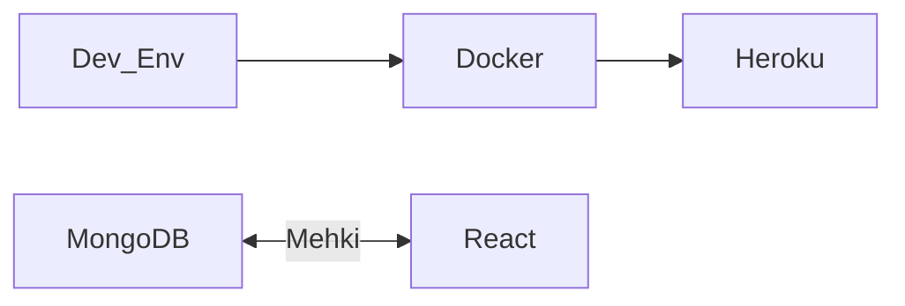

# TTFHW

### Prerequisites

    * Git and Git Bash
    * Node.js
    * Visual Studio Code

### Cloning into to your workspace

```

    git clone https://github.com/jergiemascan/paketering-frontend.git in your workspace
    
```

### Working with the project in VSCode

```

    Run this to get the necessary packages for the project to work
    npm install

    This starts the React project in your default browser
    npm start
    
```


# We are Mehki

Chat application run with React and MongoDB

### Packages

    * Node.js
    * Express.js
    * Nodemon
    * Cors
    * Mongoose
    * Path
    * Jest
    * Jest runner groups


### System Overhead


# Script for building Mehki's container image in Docker

   docker build -t imagename .
   docker run -dp 3001:3001 imagename
   

